# 🎤 Ava the $AVATAR - Voice Trading

**Voice-Controlled AI Avatar Trading Platform on Ethereum**

---

## 🌟 Overview

AVA the Avatar is an innovative voice-controlled trading platform where an **AI Avatar** recognizes your voice commands and executes trading operations on the Ethereum network. Deposit funds into your Vault, speak your trading intentions, and the Avatar AI processes your voice, understands the command, and executes trades automatically.

### ✨ Key Features

- 🎤 **Voice-Activated Trading** - Trade crypto using natural voice commands
- 🤖 **AI Avatar Interface** - Interactive 3D avatar with real-time feedback
- 💰 **Smart Vault System** - Secure, non-custodial fund management
- ⛓️ **Ethereum Integration** - Direct blockchain interaction with DEX aggregators
- 🔒 **Thoroughly Tested** - Validated on AVA Mainnet (Ethereum fork) before production
- 🚀 **Lightning Fast** - Real-time execution with gas optimization

---

## 🏗️ System Architecture

```mermaid
graph TB
    subgraph USER["👤 USER"]
        U1[🎤 Voice Input<br/>Microphone]
        U2[🦊 Web3 Wallet<br/>MetaMask]
        U3[👁️ Visual Feedback<br/>3D Avatar]
    end
    
    subgraph INTERFACE["🌐 WEB INTERFACE"]
        I1[3D Avatar Display<br/>Three.js]
        I2[Voice Recognition<br/>Web Speech API]
        I3[Web3 Connection<br/>Ethers.js]
    end
    
    subgraph AI_ENGINE["🤖 AI AVATAR ENGINE"]
        A1[Speech to Text<br/>Transcription]
        A2[NLP Processing<br/>Intent Recognition]
        A3[Command Parser<br/>Extract Parameters]
        A4[Voice Response<br/>Text to Speech]
    end
    
    subgraph VAULT["💰 VAULT SYSTEM"]
        V1[User Balance<br/>Deposited Funds]
        V2[Smart Contract<br/>Fund Management]
        V3[Transaction Pool<br/>Pending Operations]
    end
    
    subgraph TRADING["📊 TRADING ENGINE"]
        T1[Order Validation<br/>Check Balance]
        T2[DEX Integration<br/>Uniswap/1inch]
        T3[Transaction Builder<br/>Gas Optimization]
        T4[Execution Monitor<br/>Status Tracking]
    end
    
    subgraph BLOCKCHAIN["⛓️ ETHEREUM NETWORK"]
        B1[Smart Contracts]
        B2[DEX Protocols]
        B3[Token Contracts]
        B4[Transaction Pool]
    end
    
    U1 --> I2
    U2 --> I3
    I1 --> U3
    
    I2 --> A1
    A1 --> A2
    A2 --> A3
    A3 --> A4
    A4 --> I1
    
    A3 --> V2
    V1 --> V2
    V2 --> V3
    
    V3 --> T1
    T1 --> T2
    T2 --> T3
    T3 --> T4
    
    T4 --> B1
    B1 --> B2
    B2 --> B3
    B3 --> B4
    
    T4 --> A4
    I3 --> B4
```



---

## 🎤 Voice Trading Flow

```mermaid
sequenceDiagram
    participant User as 👤 User
    participant Mic as 🎤 Microphone
    participant Avatar as 🤖 AI Avatar
    participant NLP as 🧠 NLP Engine
    participant Vault as 💰 Vault
    participant Trading as 📊 Trading Engine
    participant ETH as ⛓️ Ethereum
    
    User->>Mic: Speaks Command
    Note over User,Mic: "Buy 0.5 ETH worth of USDC"
    
    Mic->>Avatar: Audio Stream
    Avatar->>Avatar: Speech to Text
    Avatar->>NLP: Text Analysis
    
    NLP->>NLP: Parse Intent<br/>Extract Parameters
    Note over NLP: Action: BUY<br/>Amount: 0.5 ETH<br/>Token: USDC
    
    NLP->>Vault: Check Balance
    Vault-->>NLP: Available: 2.5 ETH ✓
    
    NLP->>Trading: Create Order
    Note over Trading: Validate & Build<br/>Transaction
    
    Trading->>Trading: Calculate Gas
    Trading->>Trading: Find Best Route
    
    Trading->>ETH: Submit Transaction
    ETH->>ETH: Execute on DEX
    
    ETH-->>Trading: Transaction Hash
    Trading-->>Avatar: Success Status
    
    Avatar->>Avatar: Generate Response
    Avatar->>User: Voice Feedback
    Note over Avatar,User: "Trade executed successfully!<br/>Bought 250 USDC"
    
    Avatar->>User: Update UI
    Note over Avatar,User: New Balance Display
```



---

## 💰 Vault System

The Vault is a smart contract-based system that securely stores user funds for instant voice-activated trading.

```mermaid
graph LR
    subgraph DEPOSIT["💵 DEPOSIT"]
        D1[Connect Wallet]
        D2[Approve Amount]
        D3[Transfer to Vault]
    end
    
    subgraph VAULT["🏦 VAULT"]
        V1[Smart Contract<br/>Storage]
        V2[Balance Tracking]
        V3[Available Funds]
    end
    
    subgraph TRADING["📊 TRADING"]
        T1[Voice Command]
        T2[Validate Balance]
        T3[Execute Trade]
        T4[Update Balance]
    end
    
    subgraph WITHDRAW["💸 WITHDRAW"]
        W1[Request Withdrawal]
        W2[Vault Approval]
        W3[Transfer to Wallet]
    end
    
    D1 --> D2
    D2 --> D3
    D3 --> V1
    V1 --> V2
    V2 --> V3
    
    V3 --> T1
    T1 --> T2
    T2 --> T3
    T3 --> T4
    T4 --> V2
    
    V3 --> W1
    W1 --> W2
    W2 --> W3
```



### Vault Smart Contract

```solidity
// SPDX-License-Identifier: MIT
pragma solidity ^0.8.20;

import "@openzeppelin/contracts/token/ERC20/IERC20.sol";
import "@openzeppelin/contracts/security/ReentrancyGuard.sol";
import "@openzeppelin/contracts/access/Ownable.sol";

/**
 * @title AVAVault
 * @dev Secure vault for storing user funds for voice trading
 */
contract AVAVault is ReentrancyGuard, Ownable {
    
    // User balance mapping
    mapping(address => mapping(address => uint256)) public balances;
    
    // Trading contract authorization
    mapping(address => bool) public authorizedTraders;
    
    // Events
    event Deposit(address indexed user, address indexed token, uint256 amount);
    event Withdraw(address indexed user, address indexed token, uint256 amount);
    event Trade(address indexed user, address indexed tokenIn, address indexed tokenOut, uint256 amountIn, uint256 amountOut);
    
    /**
     * @dev Deposit ETH to vault
     */
    function depositETH() external payable nonReentrant {
        require(msg.value > 0, "Amount must be greater than 0");
        balances[msg.sender][address(0)] += msg.value;
        emit Deposit(msg.sender, address(0), msg.value);
    }
    
    /**
     * @dev Deposit ERC20 tokens to vault
     */
    function depositToken(address token, uint256 amount) external nonReentrant {
        require(amount > 0, "Amount must be greater than 0");
        require(IERC20(token).transferFrom(msg.sender, address(this), amount), "Transfer failed");
        balances[msg.sender][token] += amount;
        emit Deposit(msg.sender, token, amount);
    }
    
    /**
     * @dev Withdraw ETH from vault
     */
    function withdrawETH(uint256 amount) external nonReentrant {
        require(balances[msg.sender][address(0)] >= amount, "Insufficient balance");
        balances[msg.sender][address(0)] -= amount;
        (bool success, ) = msg.sender.call{value: amount}("");
        require(success, "Transfer failed");
        emit Withdraw(msg.sender, address(0), amount);
    }
    
    /**
     * @dev Withdraw ERC20 tokens from vault
     */
    function withdrawToken(address token, uint256 amount) external nonReentrant {
        require(balances[msg.sender][token] >= amount, "Insufficient balance");
        balances[msg.sender][token] -= amount;
        require(IERC20(token).transfer(msg.sender, amount), "Transfer failed");
        emit Withdraw(msg.sender, token, amount);
    }
    
    /**
     * @dev Execute trade (only authorized traders)
     */
    function executeTrade(
        address user,
        address tokenIn,
        address tokenOut,
        uint256 amountIn,
        uint256 amountOut
    ) external nonReentrant {
        require(authorizedTraders[msg.sender], "Not authorized");
        require(balances[user][tokenIn] >= amountIn, "Insufficient balance");
        
        balances[user][tokenIn] -= amountIn;
        balances[user][tokenOut] += amountOut;
        
        emit Trade(user, tokenIn, tokenOut, amountIn, amountOut);
    }
    
    /**
     * @dev Get user balance
     */
    function getBalance(address user, address token) external view returns (uint256) {
        return balances[user][token];
    }
    
    /**
     * @dev Authorize trading contract
     */
    function authorizeTrader(address trader) external onlyOwner {
        authorizedTraders[trader] = true;
    }
    
    /**
     * @dev Revoke trading contract authorization
     */
    function revokeTrader(address trader) external onlyOwner {
        authorizedTraders[trader] = false;
    }
}
```

---

## 🗣️ Voice Commands

### Available Commands

| Command | Description | Example |
|---------|-------------|---------|
| 💰 **Deposit** | Add funds to vault | "Deposit 1 ETH to vault" |
| 💸 **Withdraw** | Remove funds from vault | "Withdraw 0.5 ETH" |
| 📊 **Check Balance** | View vault balance | "What's my balance?" |
| 🪙 **Check Tokens** | List portfolio tokens | "Show my tokens" |
| 🔄 **Buy** | Purchase tokens | "Buy 0.5 ETH of LINK" |
| 💱 **Sell** | Sell tokens | "Sell 50 LINK for ETH" |
| 🔁 **Swap** | Exchange tokens | "Swap 1 ETH for USDT" |
| 📈 **Price** | Check token price | "What's the price of ETH?" |
| 📜 **History** | View transactions | "Show my last 5 trades" |

---

## 🖥️ Frontend Implementation

### Voice Recognition Component

```typescript
// hooks/useVoiceRecognition.ts
import { useEffect, useState, useCallback } from 'react';

interface VoiceRecognitionResult {
  transcript: string;
  confidence: number;
  isFinal: boolean;
}

export const useVoiceRecognition = () => {
  const [isListening, setIsListening] = useState(false);
  const [transcript, setTranscript] = useState('');
  const [recognition, setRecognition] = useState<any>(null);

  useEffect(() => {
    if (typeof window !== 'undefined') {
      const SpeechRecognition = 
        (window as any).SpeechRecognition || 
        (window as any).webkitSpeechRecognition;

      if (SpeechRecognition) {
        const recognitionInstance = new SpeechRecognition();
        recognitionInstance.continuous = true;
        recognitionInstance.interimResults = true;
        recognitionInstance.lang = 'en-US';

        recognitionInstance.onresult = (event: any) => {
          let finalTranscript = '';
          
          for (let i = event.resultIndex; i < event.results.length; i++) {
            const transcript = event.results[i][0].transcript;
            if (event.results[i].isFinal) {
              finalTranscript += transcript + ' ';
            }
          }
          
          if (finalTranscript) {
            setTranscript(finalTranscript.trim());
          }
        };

        recognitionInstance.onerror = (event: any) => {
          console.error('Speech recognition error:', event.error);
          setIsListening(false);
        };

        setRecognition(recognitionInstance);
      }
    }
  }, []);

  const startListening = useCallback(() => {
    if (recognition) {
      recognition.start();
      setIsListening(true);
    }
  }, [recognition]);

  const stopListening = useCallback(() => {
    if (recognition) {
      recognition.stop();
      setIsListening(false);
    }
  }, [recognition]);

  return {
    isListening,
    transcript,
    startListening,
    stopListening,
  };
};
```

### Voice Command Parser

```typescript
// utils/commandParser.ts

export interface ParsedCommand {
  action: 'deposit' | 'withdraw' | 'buy' | 'sell' | 'swap' | 'balance' | 'price' | 'unknown';
  amount?: number;
  tokenFrom?: string;
  tokenTo?: string;
  raw: string;
}

export const parseVoiceCommand = (transcript: string): ParsedCommand => {
  const normalizedText = transcript.toLowerCase().trim();
  
  // Deposit pattern
  if (normalizedText.includes('deposit')) {
    const amountMatch = normalizedText.match(/deposit\s+([\d.]+)\s+(\w+)/i);
    if (amountMatch) {
      return {
        action: 'deposit',
        amount: parseFloat(amountMatch[1]),
        tokenFrom: amountMatch[2].toUpperCase(),
        raw: transcript,
      };
    }
  }
  
  // Withdraw pattern
  if (normalizedText.includes('withdraw')) {
    const amountMatch = normalizedText.match(/withdraw\s+([\d.]+)\s+(\w+)/i);
    if (amountMatch) {
      return {
        action: 'withdraw',
        amount: parseFloat(amountMatch[1]),
        tokenFrom: amountMatch[2].toUpperCase(),
        raw: transcript,
      };
    }
  }
  
  // Buy pattern: "Buy 0.5 ETH of LINK" or "Buy LINK with 0.5 ETH"
  if (normalizedText.includes('buy') || normalizedText.includes('purchase')) {
    const buyMatch = normalizedText.match(/buy\s+([\d.]+)\s+(\w+)\s+(?:of|worth of)\s+(\w+)/i);
    if (buyMatch) {
      return {
        action: 'buy',
        amount: parseFloat(buyMatch[1]),
        tokenFrom: buyMatch[2].toUpperCase(),
        tokenTo: buyMatch[3].toUpperCase(),
        raw: transcript,
      };
    }
  }
  
  // Sell pattern
  if (normalizedText.includes('sell')) {
    const sellMatch = normalizedText.match(/sell\s+([\d.]+)\s+(\w+)\s+(?:for|to)\s+(\w+)/i);
    if (sellMatch) {
      return {
        action: 'sell',
        amount: parseFloat(sellMatch[1]),
        tokenFrom: sellMatch[2].toUpperCase(),
        tokenTo: sellMatch[3].toUpperCase(),
        raw: transcript,
      };
    }
  }
  
  // Swap pattern
  if (normalizedText.includes('swap') || normalizedText.includes('exchange')) {
    const swapMatch = normalizedText.match(/(?:swap|exchange)\s+([\d.]+)\s+(\w+)\s+(?:for|to)\s+(\w+)/i);
    if (swapMatch) {
      return {
        action: 'swap',
        amount: parseFloat(swapMatch[1]),
        tokenFrom: swapMatch[2].toUpperCase(),
        tokenTo: swapMatch[3].toUpperCase(),
        raw: transcript,
      };
    }
  }
  
  // Balance check
  if (normalizedText.includes('balance') || normalizedText.includes('how much')) {
    return {
      action: 'balance',
      raw: transcript,
    };
  }
  
  // Price check
  if (normalizedText.includes('price') || normalizedText.includes('how much is')) {
    const priceMatch = normalizedText.match(/(?:price of|how much is)\s+(\w+)/i);
    if (priceMatch) {
      return {
        action: 'price',
        tokenFrom: priceMatch[1].toUpperCase(),
        raw: transcript,
      };
    }
  }
  
  return {
    action: 'unknown',
    raw: transcript,
  };
};
```

### Voice Trading Component

```typescript
// components/VoiceTrading.tsx
'use client';

import { useState, useEffect } from 'react';
import { useVoiceRecognition } from '@/hooks/useVoiceRecognition';
import { parseVoiceCommand } from '@/utils/commandParser';
import { useWeb3 } from '@/hooks/useWeb3';

export default function VoiceTrading() {
  const { isListening, transcript, startListening, stopListening } = useVoiceRecognition();
  const { executeTrade, getBalance } = useWeb3();
  const [status, setStatus] = useState<string>('');
  const [isProcessing, setIsProcessing] = useState(false);

  useEffect(() => {
    if (transcript) {
      handleVoiceCommand(transcript);
    }
  }, [transcript]);

  const handleVoiceCommand = async (text: string) => {
    const command = parseVoiceCommand(text);
    setIsProcessing(true);
    
    try {
      switch (command.action) {
        case 'buy':
        case 'sell':
        case 'swap':
          setStatus(`Executing ${command.action}...`);
          await executeTrade(command);
          setStatus(`✅ Trade completed successfully!`);
          // Text-to-speech feedback
          speak(`Trade executed successfully! ${command.action} completed.`);
          break;
          
        case 'balance':
          const balance = await getBalance();
          setStatus(`Your balance: ${balance} ETH`);
          speak(`Your current balance is ${balance} ETH`);
          break;
          
        case 'deposit':
          setStatus(`Depositing ${command.amount} ${command.tokenFrom}...`);
          // Handle deposit
          speak(`Deposit initiated for ${command.amount} ${command.tokenFrom}`);
          break;
          
        case 'withdraw':
          setStatus(`Withdrawing ${command.amount} ${command.tokenFrom}...`);
          // Handle withdrawal
          speak(`Withdrawal initiated for ${command.amount} ${command.tokenFrom}`);
          break;
          
        default:
          setStatus('❌ Command not recognized. Please try again.');
          speak('Sorry, I did not understand that command.');
      }
    } catch (error) {
      setStatus(`❌ Error: ${error.message}`);
      speak('An error occurred while processing your command.');
    } finally {
      setIsProcessing(false);
    }
  };

  const speak = (text: string) => {
    if ('speechSynthesis' in window) {
      const utterance = new SpeechSynthesisUtterance(text);
      utterance.rate = 1.0;
      utterance.pitch = 1.0;
      window.speechSynthesis.speak(utterance);
    }
  };

  return (
    <div className="voice-trading-container">
      <div className="avatar-display">
        {/* 3D Avatar Component */}
      </div>
      
      <div className="controls">
        <button
          onClick={isListening ? stopListening : startListening}
          className={`mic-button ${isListening ? 'active' : ''}`}
          disabled={isProcessing}
        >
          {isListening ? '🎤 Listening...' : '🎤 Start Voice Trading'}
        </button>
        
        {transcript && (
          <div className="transcript">
            <p><strong>You said:</strong> {transcript}</p>
          </div>
        )}
        
        {status && (
          <div className="status">
            <p>{status}</p>
          </div>
        )}
      </div>
    </div>
  );
}
```

---

## 🔗 Web3 Integration

### Trading Engine

```typescript
// utils/tradingEngine.ts
import { ethers } from 'ethers';
import { ParsedCommand } from './commandParser';

const VAULT_ABI = [/* Vault Contract ABI */];
const VAULT_ADDRESS = '0x...'; // Your deployed vault address

export class TradingEngine {
  private provider: ethers.providers.Web3Provider;
  private signer: ethers.Signer;
  private vaultContract: ethers.Contract;

  constructor(provider: ethers.providers.Web3Provider) {
    this.provider = provider;
    this.signer = provider.getSigner();
    this.vaultContract = new ethers.Contract(
      VAULT_ADDRESS,
      VAULT_ABI,
      this.signer
    );
  }

  async depositToVault(amount: string, token: string): Promise<ethers.ContractTransaction> {
    const amountInWei = ethers.utils.parseEther(amount);
    
    if (token === 'ETH') {
      return await this.vaultContract.depositETH({
        value: amountInWei,
      });
    } else {
      // Handle ERC20 deposits
      const tokenContract = new ethers.Contract(
        token,
        ['function approve(address spender, uint256 amount) returns (bool)'],
        this.signer
      );
      
      await tokenContract.approve(VAULT_ADDRESS, amountInWei);
      return await this.vaultContract.depositToken(token, amountInWei);
    }
  }

  async withdrawFromVault(amount: string, token: string): Promise<ethers.ContractTransaction> {
    const amountInWei = ethers.utils.parseEther(amount);
    
    if (token === 'ETH') {
      return await this.vaultContract.withdrawETH(amountInWei);
    } else {
      return await this.vaultContract.withdrawToken(token, amountInWei);
    }
  }

  async executeTrade(command: ParsedCommand): Promise<ethers.ContractTransaction> {
    // Integrate with DEX aggregator (e.g., 1inch, Uniswap)
    const quote = await this.getQuote(
      command.tokenFrom!,
      command.tokenTo!,
      command.amount!
    );
    
    // Execute trade through vault
    return await this.vaultContract.executeTrade(
      await this.signer.getAddress(),
      command.tokenFrom,
      command.tokenTo,
      ethers.utils.parseEther(command.amount!.toString()),
      ethers.utils.parseEther(quote.amountOut)
    );
  }

  async getBalance(token: string = 'ETH'): Promise<string> {
    const userAddress = await this.signer.getAddress();
    const balance = await this.vaultContract.getBalance(
      userAddress,
      token === 'ETH' ? ethers.constants.AddressZero : token
    );
    return ethers.utils.formatEther(balance);
  }

  private async getQuote(tokenIn: string, tokenOut: string, amount: number) {
    // Implement DEX aggregator integration
    // This would call 1inch API, Uniswap, etc.
    return {
      amountOut: '250', // Example
      route: [],
      gasEstimate: '150000',
    };
  }
}
```

---

## 🧪 AVA Mainnet Development

Before deploying to Ethereum Mainnet, all features were tested on **AVA Mainnet** - our private Ethereum fork.

```mermaid
graph LR
    subgraph DEV["👨‍💻 DEVELOPMENT"]
        D1[Write Smart Contracts]
        D2[Build Voice AI]
        D3[Create UI/UX]
    end
    
    subgraph AVA["🧪 AVA MAINNET<br/>Ethereum Fork"]
        A1[Deploy Contracts]
        A2[Test Voice Commands]
        A3[Simulate Trading]
        A4[Load Testing]
        A5[Bug Fixes]
    end
    
    subgraph VALIDATE["✅ VALIDATION"]
        V1[Performance Tests]
        V2[User Testing]
        V3[Final Review]
    end
    
    subgraph PROD["🚀 ETHEREUM MAINNET"]
        P1[Deploy to Production]
        P2[Live Trading]
        P3[Real Users]
    end
    
    D1 --> D2
    D2 --> D3
    D3 --> A1
    A1 --> A2
    A2 --> A3
    A3 --> A4
    A4 --> A5
    A5 --> A1
    
    A5 --> V1
    V1 --> V2
    V2 --> V3
    
    V3 --> P1
    P1 --> P2
    P2 --> P3
```



### Why AVA Mainnet?

- ✅ **Zero Cost Testing** - No real gas fees
- ✅ **Safe Environment** - No risk to real funds
- ✅ **Unlimited Iterations** - Test and redeploy freely
- ✅ **Realistic Behavior** - True Ethereum fork
- ✅ **Complete Coverage** - 100% feature testing

---

## 🚀 Getting Started

### Prerequisites

```bash
node >= 18.0.0
npm >= 9.0.0
MetaMask browser extension
```

### Installation

```bash
# Clone the repository
git clone https://github.com/your-username/ava-voice-trade.git
cd ava-voice-trade

# Install dependencies
npm install

# Set up environment variables
cp .env.example .env.local

# Deploy smart contracts (local)
npm run deploy:local

# Start development server
npm run dev
```

### Environment Variables

```bash
# .env.local
NEXT_PUBLIC_ALCHEMY_API_KEY=your_alchemy_key
NEXT_PUBLIC_VAULT_ADDRESS=0x...
NEXT_PUBLIC_CHAIN_ID=1
PRIVATE_KEY=your_private_key_for_deployment
```

---

## 🛠️ Technology Stack


---

## 📊 User Journey

```mermaid
graph TB
    Start([👤 User Visits Site])
    Start --> Connect[🦊 Connect Wallet]
    Connect --> Deposit[💰 Deposit to Vault]
    Deposit --> Ready{Ready to Trade}
    
    Ready -->|Voice Command| Speak[🎤 Speak Command]
    Speak --> Listen[🤖 Avatar Listens]
    Listen --> Process[🧠 AI Processes]
    Process --> Validate[✅ Validate Request]
    
    Validate -->|Sufficient Funds| Execute[⚡ Execute Trade]
    Validate -->|Insufficient| Deny[❌ Request More Funds]
    Deny --> Deposit
    
    Execute --> Blockchain[⛓️ Submit to Ethereum]
    Blockchain --> Confirm[✅ Transaction Confirmed]
    Confirm --> Update[📊 Update Balance]
    Update --> Feedback[🔊 Voice Feedback]
    
    Feedback --> More{More Trading?}
    More -->|Yes| Ready
    More -->|No| Withdraw[💸 Withdraw Funds]
    Withdraw --> End([👋 Session End])
    
    Ready -->|Check Status| Status[📊 View Balance/Tokens]
    Status --> Ready
```



---

## 🧪 Testing

```bash
# Run unit tests
npm run test

# Run integration tests
npm run test:integration

# Test smart contracts
npm run test:contracts

# Coverage report
npm run test:coverage
```

### Example Test

```typescript
// __tests__/commandParser.test.ts
import { parseVoiceCommand } from '@/utils/commandParser';

describe('Voice Command Parser', () => {
  it('should parse buy command correctly', () => {
    const result = parseVoiceCommand('Buy 0.5 ETH of LINK');
    
    expect(result.action).toBe('buy');
    expect(result.amount).toBe(0.5);
    expect(result.tokenFrom).toBe('ETH');
    expect(result.tokenTo).toBe('LINK');
  });

  it('should parse balance check', () => {
    const result = parseVoiceCommand('What is my balance?');
    
    expect(result.action).toBe('balance');
  });

  it('should handle unknown commands', () => {
    const result = parseVoiceCommand('Random text');
    
    expect(result.action).toBe('unknown');
  });
});
```

---

## 📖 API Documentation

### REST API Endpoints

```typescript
// GET /api/vault/balance
// Returns user's vault balance

GET /api/vault/balance?address=0x123...&token=ETH

Response:
{
  "success": true,
  "balance": "2.5",
  "token": "ETH"
}
```

```typescript
// POST /api/trade/execute
// Execute a trade

POST /api/trade/execute
Content-Type: application/json

{
  "action": "buy",
  "amount": 0.5,
  "tokenFrom": "ETH",
  "tokenTo": "LINK"
}

Response:
{
  "success": true,
  "txHash": "0xabc...",
  "amountOut": "250.5"
}
```

---

## 🔒 Security

- ✅ Smart contracts tested on AVA Mainnet
- ✅ OpenZeppelin security patterns
- ✅ Reentrancy guards on all external calls
- ✅ Access control for critical functions
- ✅ Rate limiting on API endpoints
- ✅ Input validation and sanitization
- ✅ Secure key management

---

## 🤝 Contributing

We welcome contributions! Please see [CONTRIBUTING.md](CONTRIBUTING.md) for details.

1. Fork the repository
2. Create your feature branch (`git checkout -b feature/AmazingFeature`)
3. Commit your changes (`git commit -m 'Add some AmazingFeature'`)
4. Push to the branch (`git push origin feature/AmazingFeature`)
5. Open a Pull Request

---

## 📄 License

This project is licensed under the MIT License - see the [LICENSE](LICENSE) file for details.

---

## 📞 Contact

- Website: [avavoice.trade](https://avavoice.trade)
- Dapp: [app.avavoice.trade](https://app.avavoice.trade)
- Documentation: [app.avavoice.trade/docs](https://app.avavoice.trade/docs)
- Twitter: [@AvaVoiceTrading](https://x.com/AvaVoiceTrading)
- telegram: [Join our community](https://t.me/AvaVoiceTrading)
- Email: info@avavoice.trade

---

## 🌟 Acknowledgments

- OpenZeppelin for secure smart contract libraries
- Ethereum Foundation for the blockchain infrastructure
- The Web3 community for continuous innovation
- All contributors and testers who made this possible

---

**Built with ❤️ by the AVA Voice Trade Team**

[⭐ Star us on GitHub](https://github.com/AvaVoiceTrading/AvaVoiceTrading) | [🐛 Report Bug](https://github.com/AvaVoiceTrading/AvaVoiceTrading/issues) | [💡 Request Feature](https://github.com/AvaVoiceTrading/AvaVoiceTrading/issues)
